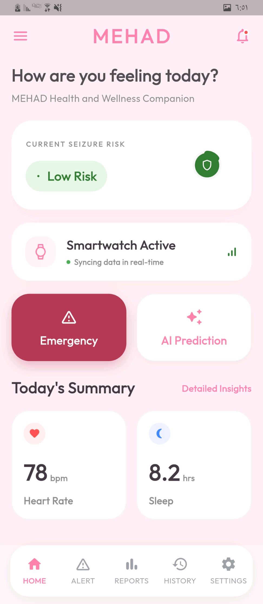
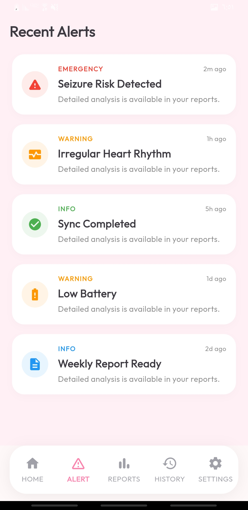
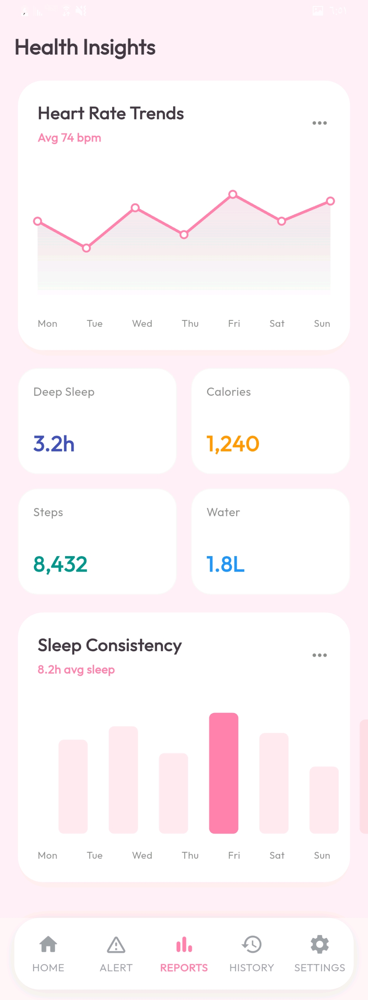
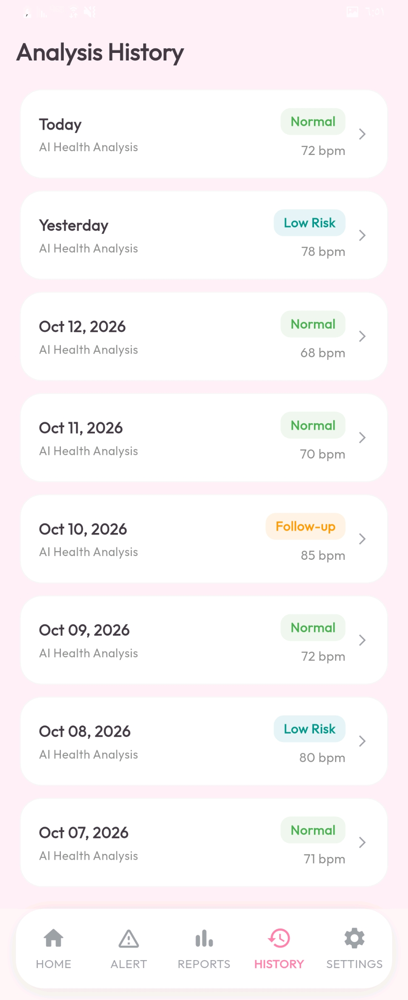
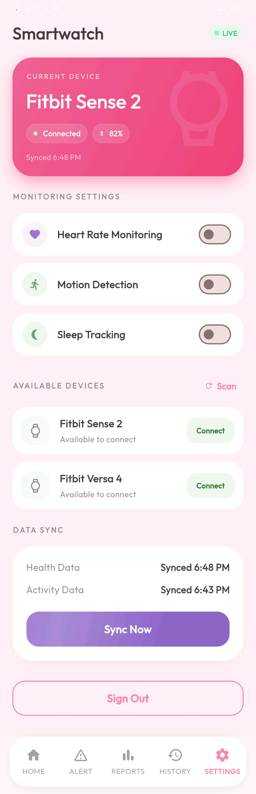

# MEHAD Health & Wellness App

MEHAD is a mobile health and wellness companion app concept designed to help users monitor seizure risk, track health indicators through smartwatch data, and access emergency support quickly.

The app interface focuses on a clean, soft, and user-friendly mobile experience with real-time health monitoring, AI prediction, daily health summaries, alerts, reports, history, and settings.

---

## 📱 App Overview

MEHAD provides users with a simple dashboard to track their current seizure risk, smartwatch connection status, emergency access, AI prediction, heart rate, sleep duration, reports, history, and app settings.

The design uses a soft pink visual identity, rounded cards, clear typography, and accessible navigation to create a calm and supportive health experience.

---

## 🚀 Features

- Current seizure risk status
- Smartwatch activity tracking
- Real-time syncing indicator
- Emergency button
- AI prediction feature
- Daily health summary
- Heart rate tracking
- Sleep duration tracking
- Alert screen
- Reports screen
- History screen
- Settings screen
- Modern mobile UI design
- Soft health-focused visual style

---

## 🛠️ Technologies / Design Scope

This repository can be used for:

- Mobile app UI design
- Flutter implementation
- Health monitoring app concept
- Smartwatch integration concept
- AI prediction feature planning

Suggested technologies:

- Flutter
- Dart
- Firebase or Supabase
- Smartwatch API integration
- AI/ML prediction model

---

## 📸 Screenshots

### Home Screen

### Alerts Screen

### Reports Screen

### History Screen

### Settings Screen

---

## 📌 Main Screens

### Home
Displays the current seizure risk, smartwatch status, emergency button, AI prediction, and daily health summary.

### Alerts
Shows health alerts and emergency-related notifications.

### Reports
Displays health reports and tracked indicators.

### History
Shows previous health readings, alerts, and activity records.

### Settings
Allows users to manage profile, smartwatch connection, notifications, and app preferences.

---

## 🎯 Purpose

The purpose of MEHAD is to provide a supportive digital health experience for users who need continuous wellness monitoring, seizure risk awareness, and quick emergency access.

---

## 👨‍💻 Author

**Abdulrahman AlBazeili**  
GitHub: [@abufahd-byte](https://github.com/abufahd-byte)

---

## 📄 License

This project is licensed under the MIT License.
